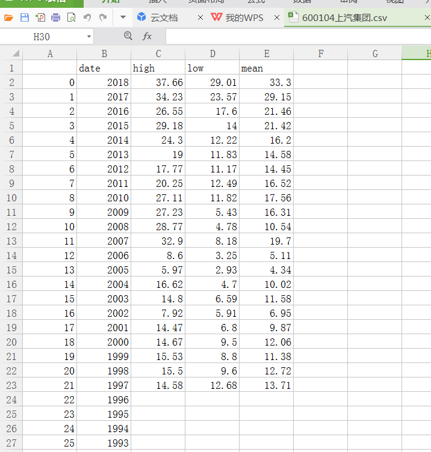

###windows端

**1.部署Python 3.x版**

获取 https://www.python.org/ftp/python/3.7.0/python-3.7.0-amd64.exe 安装包

图形界面安装完成后，输入如下命令验证是否成功:
```bash
C:\Users\sdzhang>python -V
Python 3.7.0

C:\Users\sdzhang>pip -V
pip 10.0.1 from c:\users\sdzhang\appdata\local\programs\python\python37\lib\site
-packages\pip (python 3.7)
```

**2.部署tushare**
```python
pip install tushare
pip install bs4

>>> import tushare
>>> print(tushare.__version__)
1.2.11
```

**3.运行demo例子**
```python
D:\Zstock-master>python Zstock_select_price3x.py
---------stock code---------
600104
上汽集团
----------------------------
    date   high    low   mean
25  1993    NaN    NaN    NaN
24  1994    NaN    NaN    NaN
23  1995    NaN    NaN    NaN
22  1996    NaN    NaN    NaN
21  1997  14.58  12.68  13.71
20  1998  15.50   9.60  12.72
19  1999  15.53   8.80  11.38
18  2000  14.67   9.50  12.06
17  2001  14.47   6.80   9.87
16  2002   7.92   5.91   6.95
15  2003  14.80   6.59  11.58
14  2004  16.62   4.70  10.02
13  2005   5.97   2.93   4.34
12  2006   8.60   3.25   5.11
11  2007  32.90   8.18  19.70
10  2008  28.77   4.78  10.54
9   2009  27.23   5.43  16.31
8   2010  27.11  11.82  17.56
7   2011  20.25  12.49  16.52
6   2012  17.77  11.17  14.45
5   2013  19.00  11.83  14.58
4   2014  24.30  12.22  16.20
3   2015  29.18  14.00  21.42
2   2016  26.55  17.60  21.46
1   2017  34.23  23.57  29.15
0   2018  37.66  29.01  33.30
```
并且可以生成一个execel文件，用于历史股价分析用。如下:600104上汽集团.csv




